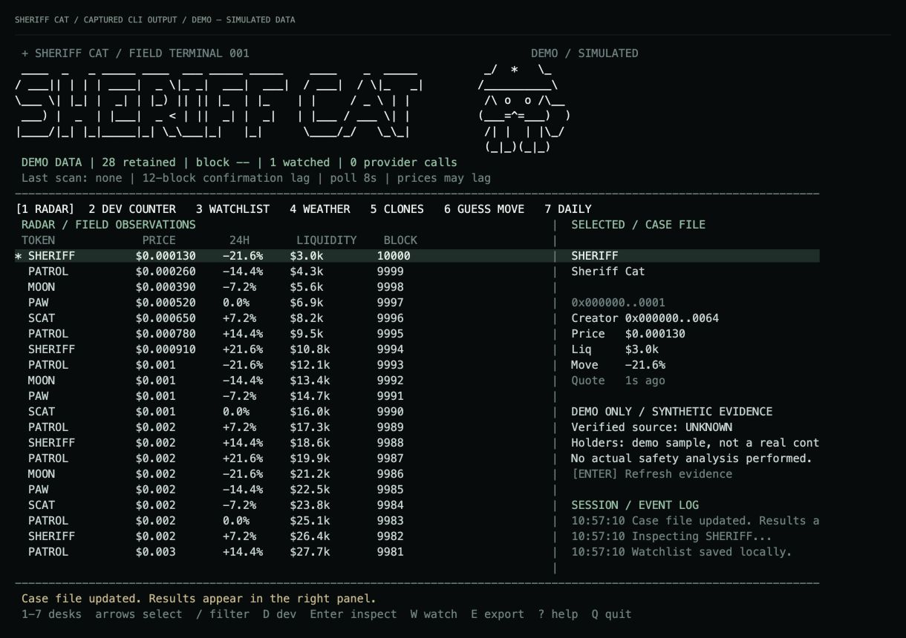
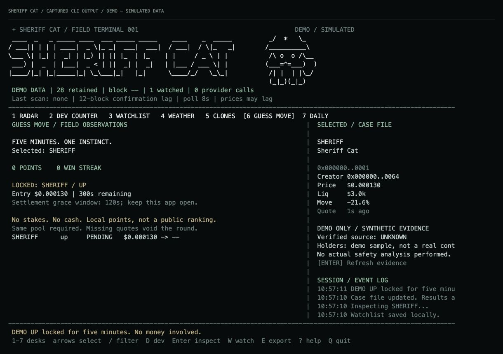
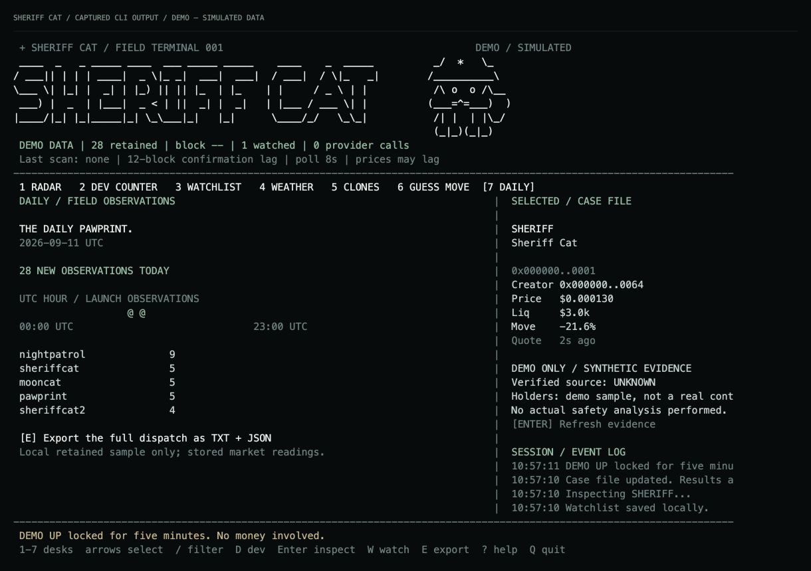

# SHERIFF CAT — Field Terminal

A standalone, read-only command-line app for Robinhood Chain / Pons. Runs on your machine, calls data providers directly, and does not require the SHERIFF CAT website, Cloudflare, a wallet or trading permissions.

## Screenshots

Actual terminal output from the offline **DEMO / SIMULATED** session, captured from a pseudoterminal and rendered as images. These are sample tokens, not live market results.



| Guess the Move | Sheriff Daily |
| --- | --- |
|  |  |

## Research desks

| Desk | What you can do |
| --- | --- |
| NEW CAT RADAR | Follow newly observed Pons launches and inspect a selected contract. |
| DEV COUNTER | Paste a contract and find launches from the same creator in your retained archive. |
| CAT WATCHLIST | Star tokens locally and compare prices with the start of your session. |
| MEME WEATHER | See the distribution of available 24-hour price changes. |
| CLONE DETECTOR | Compare similar names and tickers and their observed order. |
| GUESS THE MOVE | Predict higher/lower over five minutes for local points. |
| SHERIFF DAILY | Read and export a UTC daily briefing as text and JSON. |
| RESEARCH DESK | Custom alerts, change history, public address monitoring, size models and paper positions. |

## Run

Install **Node.js 22 or newer**. Download this folder from GitHub (or the source ZIP), open a terminal in it, and run:

```sh
node bin/sheriff.mjs
```

Or clone the repository:

```sh
git clone https://github.com/bubblik525/sheriff_cat.git
cd sheriff_cat
node bin/sheriff.mjs
```

No dependency installation or build is needed. Try `node bin/sheriff.mjs --demo` first to explore every desk without an API key.

Create your personal PRO API key at https://dev.blockscout.com/ and paste it into the hidden prompt. It is kept in process memory and never saved by this app. You can alternatively supply `BLOCKSCOUT_API_KEY` through your environment. Do not enter a wallet private key or seed phrase.

This package has **not been published to npm**. Do not assume `npx sheriff-cat` points to this project.

```sh
node bin/sheriff.mjs --demo            # Offline sample; explicitly marked DEMO
node bin/sheriff.mjs --demo --snapshot # Print the sample screen, no raw terminal
node bin/sheriff.mjs --doctor          # Check your key, chain ID and market endpoint
node bin/sheriff.mjs --help
node --test test/*.test.mjs
```

Use a terminal at least 106 columns wide for the two-pane layout; 120 × 38 is recommended. At 76–105 columns the app uses one pane. An 80 × 24 terminal uses a compact header. Windows Terminal, macOS Terminal and Linux terminals with ANSI support are suitable.

## Controls

| Key         | Action                                                  |
| ----------- | ------------------------------------------------------- |
| 1–8         | Radar, creator, watchlist, weather, clones, game, daily, research |
| :           | Enter a research command; Enter submits, Esc cancels |
| ← →         | Switch Alerts / Changes / Wallets / Paper on desk 8 |
| ↑ ↓ / j k   | Select a row; scroll open evidence or help                  |
| PgUp / PgDn | Jump 10 records                                         |
| /           | Filter names, tickers, addresses; empty input clears    |
| D           | Paste a token contract to find its creator              |
| Enter / I   | Open the complete evidence report   |
| Esc         | Close evidence/help or cancel input                     |
| Ctrl-U      | Clear the current text input                            |
| W / Space   | Toggle local watchlist                                  |
| U / N       | Higher/lower prediction on game desk                    |
| E           | Export daily text and JSON into the data directory      |
| P / R       | Pause collection / refresh                              |
| ?           | Help                                                    |
| Q / Ctrl-C  | Save and exit; restore terminal                         |

## What is real, what is limited

- Reads confirmed `TokenLaunched` logs from the configured Pons factory on chain **4663**, with a 12-block lag. First scan covers up to 2,000 recent blocks; subsequent scans advance from the saved cursor. A failed scan does not advance it. This is an observation archive, not all historical launches.
- Retains up to 5,000 launches locally. Dev Counter counts only this retained history. No inference of real-world identity, shared ownership or fraud.
- Market updates use DEX Screener in batches of 30. Unindexed tokens have unknown prices. Up to 100 watched/newest tokens are refreshed; other prices retain their original observation timestamps.
- On-demand checks report source verification, holder count, the first ten listed holder balances as a fraction of total supply, and proxy implementation listings. Pools/contracts are included. Mint restrictions, transfer taxes, honeypots and liquidity locks are **not checked**; no safety score is fabricated.
- Weather uses stored 24h changes and needs at least five readings. Daily counts first observations in UTC, not exact deployment-day totals. Clone detection covers the latest 500 retained records, capped at 150 pairs. Similarity is not evidence of fraud.
- Guess the Move is a local game with one five-minute round, no stakes and no prizes. Uses the first observed same-pool quote within two minutes after the deadline. Missing quotes void the round; leaving the app closed can void it. Provider prices may lag. Local scores are not tamperproof rankings.
- DEMO never accesses the network and uses a separate state file. Demo round settlement is synthetic and does not measure prediction skill.

## Local data and privacy

Files live in `~/.sheriff-cat` (override with `--data-dir PATH`). State is atomically replaced and access permissions are restricted where the OS supports them. A process lock prevents two apps from overwriting the same file. After a crash, check that the old process has stopped before removing the indicated `.lock` file. Corrupt data is not silently reset.

Tokens can contain malicious text; the renderer strips non-ASCII control characters and clips output. API keys are sent only to `api.blockscout.com` in the Authorization header; the market provider never receives them. No telemetry, server or login on SHERIFF CAT is required. Your API/provider quotas still apply; reads are paced and transient errors back off.

## Quick start по-русски

1. Установите Node.js версии 22 или новее.
2. Скачайте репозиторий через **Code → Download ZIP** и распакуйте его.
3. Откройте терминал в распакованной папке и выполните `node bin/sheriff.mjs --demo`.
4. Для настоящих данных создайте свой PRO API-ключ в [Blockscout](https://dev.blockscout.com/), запустите `node bin/sheriff.mjs` и вставьте ключ в скрытый ввод.
5. Переключайте вкладки клавишами **1–8**, выбирайте монету стрелками, **Enter** открывает досье, **W** добавляет в избранное, **?** показывает справку.

Подключать кошелёк не нужно. Это отдельная программа для компьютера; браузер и сайт для её работы не требуются. Неизвестные показатели остаются неизвестными: программа не выдаёт токену фиктивный рейтинг безопасности.

## Troubleshooting

| Symptom | What to check |
| --- | --- |
| `node` is not found | Install Node.js 22+ and reopen your terminal. |
| Small screen warning | Enlarge the terminal to at least 80 × 24; 120 × 38 is more comfortable. |
| 401 / 403 | Check your personal Blockscout PRO key and access to chain 4663. |
| 429 | Your provider quota applies. Wait for the cooldown; repeated refreshes do not bypass it. |
| Empty radar | Wait for a successful confirmed-block scan. The initial window is recent, not the entire chain history. |
| Missing price or holders | The provider may not have indexed that contract/pool. Unknown is not zero. |
| Wrong chain | Use a provider supporting the configured Robinhood Chain ID 4663. |
| Corrupt state | Back up the indicated JSON file before repairing it; the app will not silently erase your archive. |
| Existing lock | Close the other process. Only remove a stale lock after confirming it is no longer running. |

Run `node bin/sheriff.mjs --doctor` for provider diagnostics. It checks connectivity and chain identity, not every market's data quality.

## Development and verification

```sh
npm test
node bin/sheriff.mjs --demo --snapshot
python3 test/pty_smoke.py
```

The Python pseudoterminal check runs on macOS/Linux. GitHub Actions runs Node tests and snapshot startup on Linux, macOS and Windows with Node 22 and 24; keyboard integration runs on Linux/macOS.

Tests cover archive validation and locking, rendering, clone selection, quote identity, game settlement, API failure handling and credential isolation. The keyboard integration exercises navigation, filtering, creator lookup, watchlist persistence, predictions, daily export and clean shutdown. API tests use controlled responses: passing them does **not** certify current external provider availability or your key's permissions.

## Research Desk (v0.2.0)

Select a token in Radar, then press **8**. Your selected token stays fixed while you scroll this desk. Use **Left/Right** for its four pages, **Up/Down** to scroll and **:** to type a command. Commands also work directly from Radar. The examples below include the `:` key you press to open the command input.

| Command | Result |
| --- | --- |
| `:alert liquidity>=20000,volume>50000` | Alert for the selected token when **both** conditions become true. |
| `:alert all change>10,buys>=20` | Apply a rule to tokens with fresh market observations in the monitored sample. |
| `:unalert ID` | Remove a rule using its displayed eight-character ID. |
| `:alerts` / `:changes` / `:wallets` / `:paper` | Open the corresponding research page. |
| `:wallet 0x...` | Monitor a public address; paste the full address. |
| `:unwallet 0x...` | Stop monitoring an address. |
| `:size 100 30 50` | Model a $100 entry, 30 bps fee and 50 bps additional slippage. |
| `:paper 100 10 20 30 50` | Open a $100 virtual position: 10% stop, 20% target, 30 bps fee, 50 bps additional slippage. |
| `:close ID` | Close an open virtual position at the next available modeled fill. |

**1 basis point (bps) = 0.01%.** Fees/slippage default to 30/50 bps; stop/target default to 10/20%. No money moves. API keys remain personal and memory-only.

### Signals and changes

Rules accept `price` (USD), `liquidity` (USD), `volume` (rolling 24-hour USD volume), `change` (24-hour percentage change), and `buys` (one-hour buy transaction count, **not unique buyers**). Supported operators: `>`, `>=`, `<`, `<=`; comma-separated conditions use AND. Matches appear in the persistent Alerts list and status/event line. They do not repeat until a fresh known observation fails the conditions and a later one passes. Missing fields do not rearm the alert.

Up to 50 rules are stored. Rules on a particular token add it to the polling set. An `all` rule covers the sampled tokens being refreshed, **not the whole chain**. Providers can lag; alerts require a locally observed price no older than 120 seconds. Notifications are in the terminal, not Telegram/email or OS push; the program must be running.

Changes compare consecutive saved market observations, including the last observation from the previous session. Price changes of at least 3% and liquidity/rolling-volume changes of at least 10% enter the log. A pool switch is labeled and resets the comparison. This is sampled history, not every transaction, and small consecutive changes are not accumulated. Latest 300 alerts and 300 changes are retained. Press **E** to export the daily report plus the research state in JSON.

### Public address monitoring

Up to 10 addresses, checked about once a minute while collection is active. Reads the latest 50 token transfers from each address via Blockscout. The first read is labeled HISTORY; later observations are deduplicated by transaction/log identity. If the provider returns another page, the UI explicitly reports a partial window. Transfers can be missed during heavy activity or downtime; this is not a full backfill. Latest 500 transfers are retained. Amounts use token decimals when available, otherwise they are labeled raw units. IN/OUT means a transfer direction, **not a decoded buy/sell or proof of trader profitability**. Reorganizations and provider indexing can affect the feed.

### Size model and paper positions

The model assumes an equal-value constant-product pool with quote-side reserve `R = reported USD liquidity / 2`. For an entry amount `A`, fee fraction `f`, additional slippage fraction `s`, and spot price `P`, estimated tokens are `(R/P) × A(1−f) / (R + A(1−f)) × (1−s)`. Selling applies the reverse curve and both exit costs. The displayed curve premium is `A(1−f)/R` and is distinct from the all-in cost.

**This is a hypothetical scenario, not an executable router quote.** Actual reserves/pool type are not verified; concentrated liquidity, taxes, gas, MEV and routing are not modeled. No result is shown if fresh price or positive liquidity is missing. Your selected fee and slippage assumptions are stored with the position.

Paper cash starts at **$10,000**, with up to 20 open positions and 200 retained position records. Stops/targets are percentages of entry **spot price**. Net PnL includes modeled entry/exit costs. Automatic exits use a fresh observed quote from the original pool, even if it has already moved past your target/stop; they do not invent fills exactly at the threshold. No candles or intrapoll highs/lows are inferred. If the pool or fresh data is unavailable, the position stays open and is marked stale. On restart, evaluation resumes at the next available observation; it cannot reconstruct missed exits. Paper monitoring continues while launch collection is paused, but stops when the app closes. DEMO prices are synthetic and are not backtest results.

### Combined dossier

**Enter** opens the selected token's contract address, creator, creator-launch count in the retained archive, price, liquidity, pool identity, market observation time, evidence check time, verification status, first-ten-listed-holder concentration, proxy information and source coverage. Missing checks stay UNKNOWN / NOT CHECKED; no safety percentage is invented.

Provider schema references: [DEX Screener API](https://docs.dexscreener.com/api/reference), [Blockscout address controller](https://github.com/blockscout/blockscout/blob/master/apps/block_scout_web/lib/block_scout_web/controllers/api/v2/address_controller.ex).

The application is read-only. It does not sign transactions, execute trades or promise returns. SHERIFF CAT's own token receives no special safety exemption.
