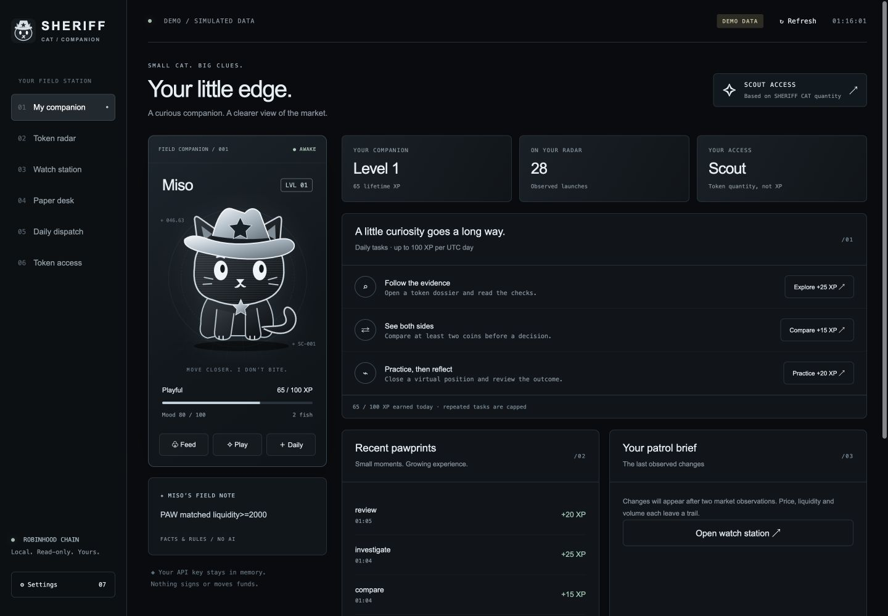
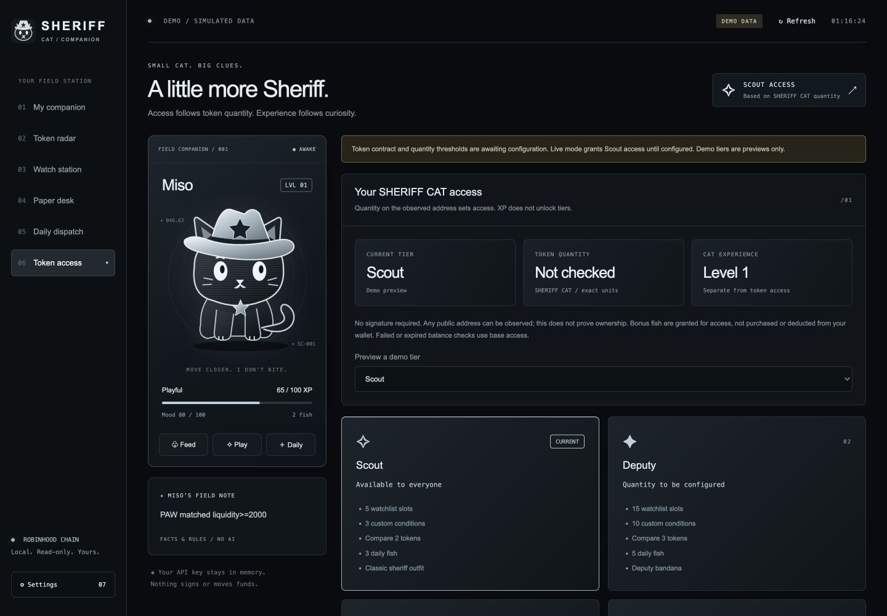
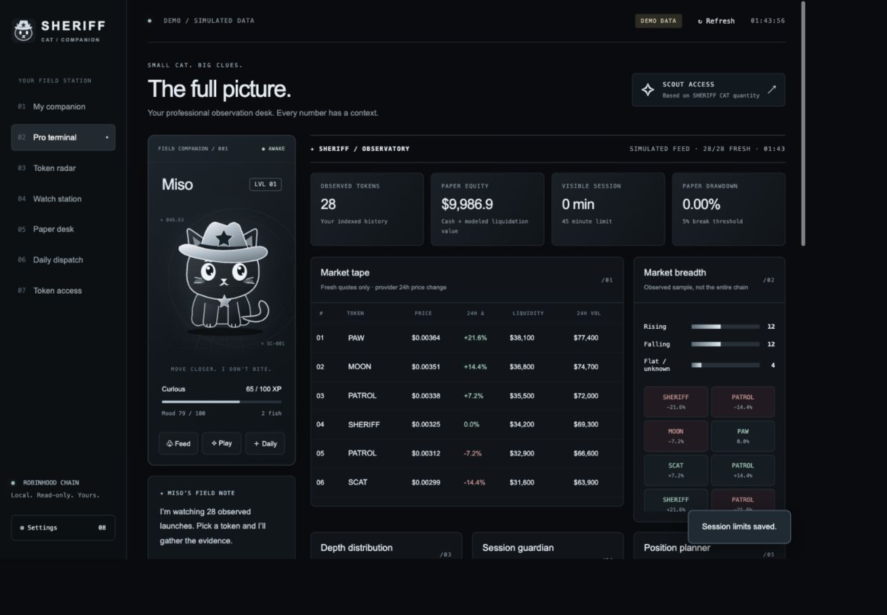
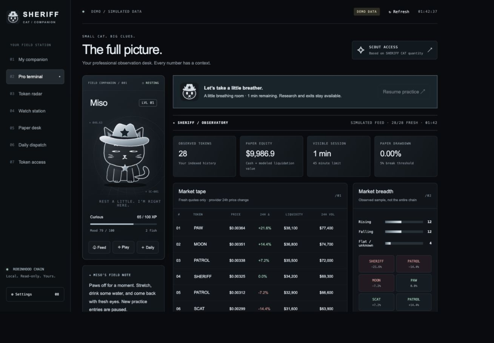
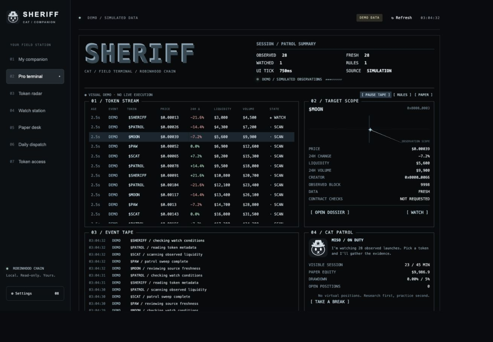

# SHERIFF CAT Desktop

A standalone desktop companion for observing Robinhood Chain tokens, researching contracts and practicing with paper positions. No browser window, wallet signature or AI subscription required.

## Download and open

The desktop version opens its own window. End users do not need Node.js. Build artifacts can be attached to this repository’s GitHub Releases:

- macOS: open the DMG and drag **SHERIFF CAT** into Applications.
- Windows: run the `.exe` installer.
- Linux: make the `.AppImage` executable and run it.

These are currently unsigned preview builds. Public distribution without operating-system identity warnings requires signing/notarization; this repository contains no signing credentials. macOS Apple Silicon launch is verified locally. Windows x64 and macOS Intel installers are built on macOS; their native launch is not yet verified. GitHub Actions includes a native window smoke test on the Windows runner. Linux is configured but not built locally.

## Run from source

Install Node.js 24 LTS, then in this repository:

```sh
npm ci
npm start
```

For simulated data: `npm run demo`. Use **File → Explore demo mode / Switch to live mode** to restart in the other mode. Live mode starts without an API key; enter your personal key in Settings. Demo and live profiles are separate. Keys remain in process memory and must be entered again after restarting.

## Build installers

```sh
npm ci
npm test
npm run dist
```

Installers appear in `dist/`. `npm run pack` creates an unpacked application. The icon is included in `build/icon.png`; regenerate it with `npm run icon`.

To publish the source, upload the **contents of this terminal-cli folder** to the root of `bubblik525/sheriff_cat`, including `package-lock.json`, `build/` and `.github/`. Do not upload `node_modules/`, `dist/`, keys or personal profiles. The included GitHub Actions workflow builds macOS, Windows and Linux artifacts when manually run or when a `v*` tag is pushed. Download the artifacts from Actions and attach the desired installers to a GitHub Release. It does not publish releases automatically.

## Local data and security

**File → Open data folder** opens the profile directory. The desktop app uses the operating system’s application-data folder, separate from the old browser companion. A random loopback port and a fresh session credential protect its internal API. The interface is sandboxed and has no Node.js access. External websites open only after confirmation. Closing the app stops scanning and saves its profile; it does not run a background trading service.

The older browser launcher remains available as `npm run web` or `npm run web:demo`. The ASCII command-line version remains `npm run terminal`.

---

# SHERIFF CAT / Companion

**Small cat. Big clues.** A local, read-only market companion for Robinhood Chain / Pons. Raise a silver sheriff cat, investigate launches, watch conditions and practice with virtual positions. No AI, wallet connection or signatures.





Screenshots show the real interface running with explicitly simulated observations.

## Start in one command

Optional browser mode: install Node.js **24 or newer**, open this repository in a terminal and run:

```sh
node bin/companion.mjs --demo
```

Open the private `http://127.0.0.1:4177/#…` URL printed in your terminal. This optional launcher opens the browser interface instead of the desktop window. Keep the process running. Press Ctrl+C to stop.

Demo is offline, clearly labeled, and uses fixed sample prices. It does not simulate profits or claim to be live. Demo and live profiles are separate.

For real observations:

```sh
node bin/companion.mjs
```

Open **Settings**, enter a personal [Blockscout API key](https://dev.blockscout.com/), and connect. Keys stay in process memory, never in the saved profile. Add a public address for token access. An address is observed, not verified as yours.

## A field station with a companion

- **My companion:** animated sheriff cat, cursor reactions, play, feeding, daily fish, mood, experience and outfits.
- **Token radar:** observed Pons launches, name/contract search, sorting, comparisons, meme weather and similar-name matches.
- **Dossier:** creator, creator launches in the archive, available contract checks, holder concentration, market observations and freshness.
- **Watch station:** local watchlist, custom threshold conditions, persisted changes and public-address transfers.
- **Paper desk:** entry-size estimates, virtual positions, stop/target handling, modeled fees/slippage, and a one-minute prediction game.
- **Daily dispatch:** UTC observation chart, daily report, clipboard copy and text export.
- **Token access:** four configurable quantity-based tiers, separate from cat XP.

All interface text and cat messages are in English. Pet reactions use rules, not an AI model. The original ASCII terminal remains available with `node bin/sheriff.mjs`; see [Field Terminal documentation](FIELD-TERMINAL.md).

## Token access

| Tier    | Watched coins | Conditions | Compare coins | Daily fish |
| ------- | ------------: | ---------: | ------------: | ---------: |
| Scout   |             5 |          3 |             2 |          3 |
| Deputy  |            15 |         10 |             3 |          5 |
| Sheriff |            40 |         25 |             5 |          8 |
| Marshal |           100 |         50 |             8 |         12 |

The **actual number of SHERIFF CAT tokens**, not USD value, trade count or XP, determines access. ERC-20 `balanceOf` and `decimals` are read at one block and compared using integer arithmetic. Missing, failed or expired checks grant base access. Live mode verifies the chain ID.

**The contract and quantity thresholds are intentionally not configured yet.** Until configured, live mode grants Scout access. Preview tiers in offline Demo under Token access.

Owner configuration uses environment variables:

```text
SHERIFF_TOKEN_CONTRACT=<actual ERC-20 contract>
SHERIFF_TOKEN_THRESHOLDS=<deputy quantity>,<sheriff quantity>,<marshal quantity>
```

Exactly three positive increasing decimal quantities are required. No production values are invented. Access checks refresh approximately once a minute; cached grants expire after five minutes. Excess saved watch entries and conditions survive a downgrade, but only the first allowed slots receive priority monitoring / rule evaluation. Existing virtual positions remain monitored.

Fish are access bonuses; **no tokens are spent**. All users receive the same honest evidence. SHERIFF CAT has no privileged risk score. Outfits unlock through token access; pet level does not grant higher access.

## Pet rules

- 100 XP per level, at most 100 XP per UTC day.
- Dossier: 25 XP. Comparison: 15 XP. Paper review: 20 XP.
- Daily fish: 10 XP; one claim per UTC date regardless of tier changes.
- Feed/play: 5 XP; one reward per action per minute. Visual jumps grant no XP.
- Mood gently decays to a floor of 20; losses never punish the pet.
- Cloud mode limits each research task type to one award per day. These are engagement rewards, not proof of attention or trading.

## Storage and optional cloud progress

Local data lives in `~/.sheriff-cat/companion`. Use `--data-dir PATH` to choose another directory and `--port 4178` if occupied. Atomic saves and a lock prevent concurrent local writers.

The server binds only to `127.0.0.1`. A random private session URL unlocks API access; foreign origins, unexpected hosts and unauthenticated requests are rejected. Treat the URL as private. Private wallet keys are never requested.

The optional [Cloudflare D1 service](cloud/README.md) stores authoritative pet progress, checks holder access server-side and rejects duplicate/concurrent awards. It is supplied as source and is **not deployed or enabled by default**. Set `SHERIFF_CLOUD_URL` to enable your deployed service. Demo never syncs. Market history, personal provider keys and paper positions remain local.

Local files and open-source clients can be modified by their owners. Cloud rules protect shared progression, not an arbitrary client's UI. Without a wallet signature, anyone can observe a qualifying public address. Do not use these levels for monetary payouts or scarce financial rewards.

## Data and trading limits

- Launches: factory observations every 8 seconds, 12-block lag, bounded 2,000-block scans, up to 5,000 retained tokens. Not a complete chain index.
- Markets: available DexScreener pools approximately every 30 seconds, up to 100 prioritized tokens. Retrieval time is not last-trade time.
- Addresses: latest 50 provider transfers every minute, up to 10 addresses. Incomplete windows are labeled. IN/OUT is not BUY/SELL.
- Dossier: source verification, first listed holders and creator metadata. Mint permissions, taxes, blacklist and LP lock are **not checked**. Unknown never implies safe.
- Paper: hypothetical constant-product reserves inferred from liquidity, fees/slippage on both sides, no gas/tax/MEV. Stops fill at observed prices and can miss intrapoll moves. Stale/wrong-pool quotes cannot settle positions.
- Predictions use a fresh same-pool observation within two minutes of the deadline; otherwise void. Fixed demo prices normally produce draws.
- Monitoring and virtual exits require the program to remain open. Cloud pet sync is not a background trading engine.

## Checks

```sh
node --test test/*.test.mjs
```

Tests cover exact thresholds, expiry, task caps, persistence, demo isolation, virtual accounting, data errors, cloud credential isolation and concurrent claims. Live provider availability and real holder unlocks need credentials and the actual token contract.

## Pro Terminal and Session Guardian

The **Pro terminal** tab combines a fresh-quote market tape, 24-hour change heatmap, market breadth, liquidity distribution, alert inbox, paper equity and a position-sizing calculator. All panels use the observed token sample, not whole-chain statistics. Demo mode stays clearly marked as simulated.

Your silver sheriff now has larger eyes, little cheek highlights, a curious head tilt and a resting expression during breaks.

Session Guardian defaults to **45 minutes of visible use**, **5% paper-equity drawdown** and a **10-minute break**. Configure these limits in Pro Terminal. Visible browser heartbeats track approximate foreground time, excluding gaps longer than 30 seconds. Multiple windows do not multiply elapsed time. Paper equity includes cash plus fresh, same-pool modeled liquidation values; unknown quotes produce an unknown balance, never an invented loss.

When a limit is reached, new paper positions and prediction games pause on the local backend. Reading information and closing positions remain available. After the countdown, press **Resume practice**. The cooldown survives restarting the app and cannot be shortened through the settings while active. This is a local self-discipline feature, not tamper-proof enforcement, medical fatigue detection, real-wallet PnL monitoring, or a restriction on external trading.

The position calculator uses budget × risk percentage ÷ stop percentage. It is arithmetic, not a recommended position or guaranteed loss ceiling.





## Dense field terminal

Pro Terminal now offers a black/silver monospace observation desk: selectable token stream, target scope, rotating scope indicator, timestamped event tape, session guardian and collapsible advanced tools. Use a token button to select it; open its dossier or add it to your watchlist from Target Scope. Pause Tape freezes the event list, not market collection or risk monitoring.

The local UI reads state every 750 ms. The engine targets a one-second cycle and requests one rotating market batch of up to 30 tokens per cycle. Network latency, provider backoff, batch rotation and the existing 12-block launch confirmation delay affect actual freshness. No sub-second upstream delivery is guaranteed.

Demo mode now evolves simulated quotes each engine tick and introduces a new simulated token every eight ticks, capped at 120 tokens. Paper trading uses those simulated quotes. Real mode never generates fictional launches or prices. The event tape records changes, first quotes and activity-verdict transitions, with a bounded history of 60 quotes per tracked token.

WATCH CANDIDATES ranks the first 120 observed tokens with four disclosed filters: quote age under 120 seconds, at least $10,000 liquidity, 24h volume/liquidity >= 0.5, and 24h change between -15% and +35%. WATCH means these activity filters match, not that a token is safe or will rise. Contract research remains separately requested.



### Platform-specific builds

`npm run dist:win` builds a Windows x64 NSIS installer. `npm run dist:mac` builds separate Apple Silicon and Intel Mac installers. End users download the installer for their platform; Node.js is bundled with the app. Unsigned preview builds may show operating-system security warnings.
